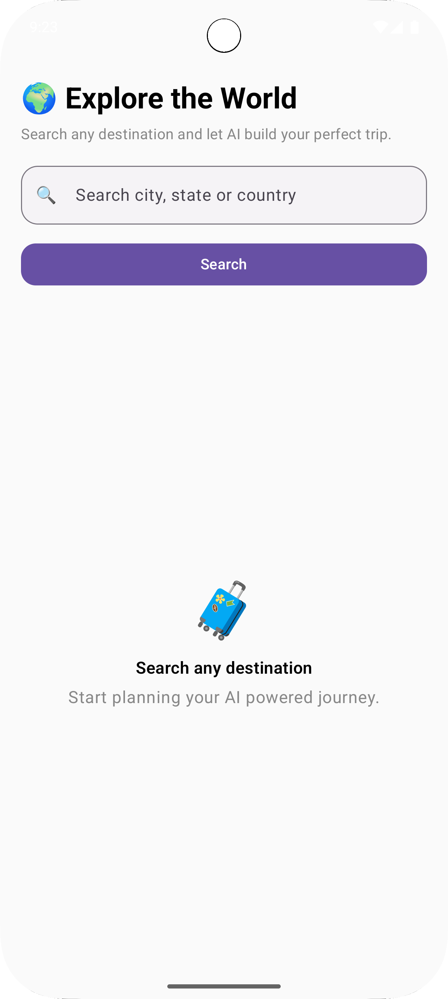
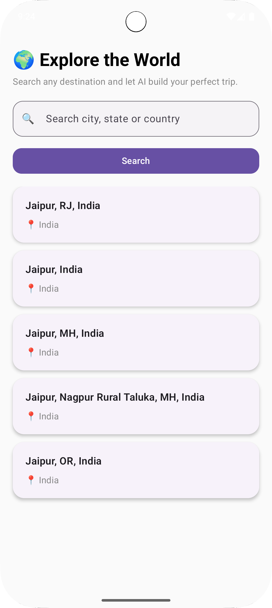
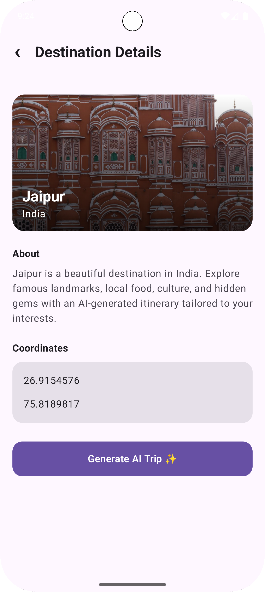
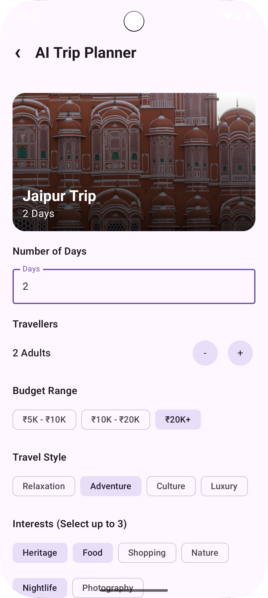
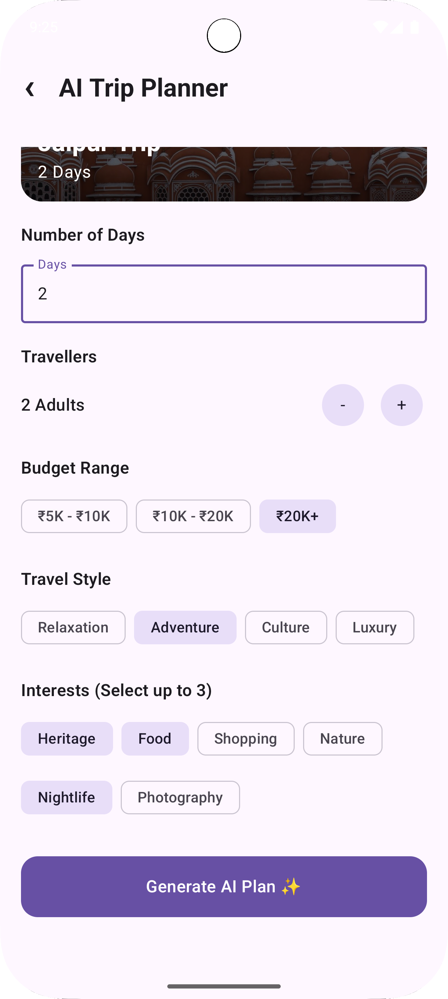
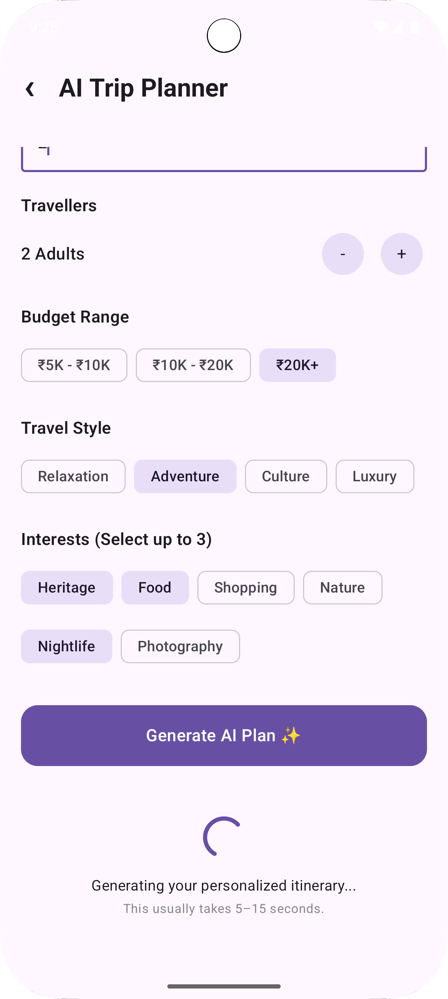
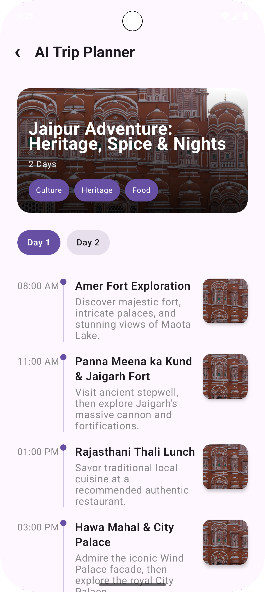
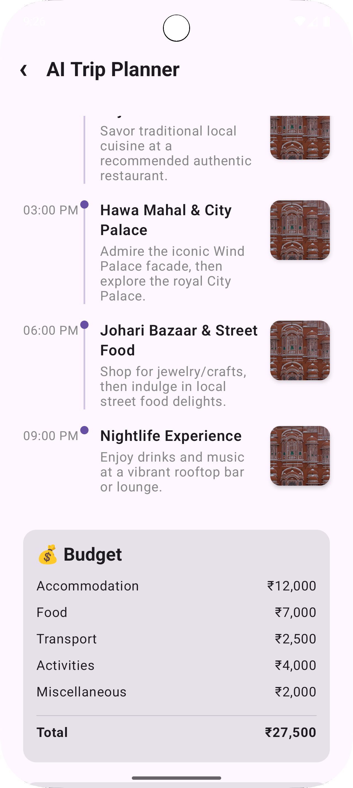
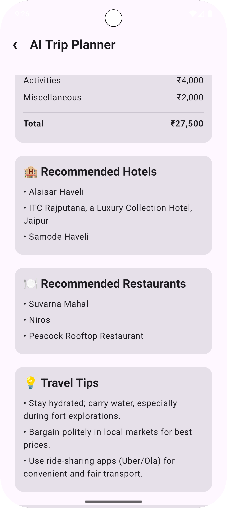
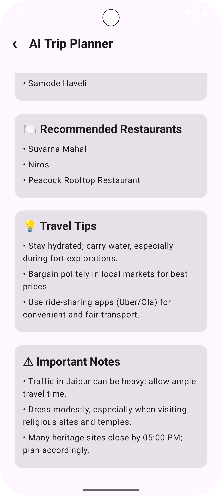

# 🌍 VoyageAI

> **AI-Powered Trip Planner built with Kotlin Multiplatform (KMP)**

VoyageAI is a modern AI-powered travel planning application that allows users to search destinations, view destination information, and generate personalized travel itineraries using Google's Gemini AI.

The project is built using **Kotlin Multiplatform (KMP)** with shared business logic, allowing the same core codebase to run on both Android and iOS.

---
# 📱 App Preview

## 🤖 Android

<p align="center">
  
  
  
  
  
</p>

<p align="center">
  <b>Home</b> &nbsp;&nbsp;&nbsp;&nbsp;&nbsp;&nbsp;
  <b>Search</b> &nbsp;&nbsp;&nbsp;&nbsp;&nbsp;&nbsp;
  <b>Details</b> &nbsp;&nbsp;&nbsp;&nbsp;&nbsp;&nbsp;
  <b>Planner</b> &nbsp;&nbsp;&nbsp;&nbsp;&nbsp;&nbsp;
  <b>Loading</b>
</p>

<br>

<p align="center">
  
  
  
  
  
</p>

<p align="center">
  <b>Itinerary</b> &nbsp;&nbsp;&nbsp;
  <b>Timeline</b> &nbsp;&nbsp;&nbsp;
  <b>Budget</b> &nbsp;&nbsp;&nbsp;
  <b>Hotels</b> &nbsp;&nbsp;&nbsp;
  <b>Tips</b>
</p>

---

## 🍎 iOS

<p align="center">
  
  
  
  
  
</p>

<p align="center">
  <b>Home</b> &nbsp;&nbsp;&nbsp;&nbsp;&nbsp;&nbsp;
  <b>Search</b> &nbsp;&nbsp;&nbsp;&nbsp;&nbsp;&nbsp;
  <b>Details</b> &nbsp;&nbsp;&nbsp;&nbsp;&nbsp;&nbsp;
  <b>Planner</b> &nbsp;&nbsp;&nbsp;&nbsp;&nbsp;&nbsp;
  <b>Loading</b>
</p>

<br>

<p align="center">
  
  
  
  
  
</p>

<p align="center">
  <b>Itinerary</b> &nbsp;&nbsp;&nbsp;
  <b>Timeline</b> &nbsp;&nbsp;&nbsp;
  <b>Budget</b> &nbsp;&nbsp;&nbsp;
  <b>Hotels</b> &nbsp;&nbsp;&nbsp;
  <b>Tips</b>
</p>

---

# ✨ Features

- 🔍 Destination Search with autocomplete
- 🌍 Destination Details
- 🖼️ Destination Images
- 🤖 AI Trip Planner powered by Gemini
- 📅 Multi-day itinerary generation
- 💰 Budget estimation
- 🏨 Hotel recommendations
- 🍽️ Restaurant recommendations
- 💡 Travel tips
- ⚠️ Important travel notes
- 📱 Android & iOS support from a shared codebase

---

# 🛠 Tech Stack

### Kotlin Multiplatform

- Kotlin Multiplatform (KMP)
- Kotlin Coroutines
- StateFlow
- Kotlin Serialization
- Koin Dependency Injection

### Android

- Jetpack Compose
- Material 3

### iOS

- Native Swift Application
- Shared Kotlin Business Logic

### Networking

- Ktor Client
- Geoapify Places API
- Pexels Image API
- Google Gemini API

---

# 🏛 Architecture

This project follows **Clean Architecture** with a feature-based structure.

```
Presentation
│
├── UI
├── Screens
├── ViewModels
└── State
        │
        ▼
Domain
│
├── Repository Interfaces
├── Models
└── Use Cases
        │
        ▼
Data
│
├── Remote APIs
├── DTOs
├── Repository Implementations
├── Mappers
└── Network Layer
```

---

# 📂 Project Structure

```
VoyageAI
│
├── androidApp
│
├── iosApp
│
├── shared
│   ├── data
│   │   ├── remote
│   │   ├── dto
│   │   ├── mapper
│   │   └── repository
│   │
│   ├── domain
│   │   ├── model
│   │   ├── repository
│   │   └── usecase
│   │
│   ├── presentation
│   │   ├── screens
│   │   ├── components
│   │   ├── viewmodel
│   │   └── state
│   │
│   └── di
│
└── screenshots
```

---

# 🚀 Getting Started

### Clone Repository

```bash
git clone https://github.com/YOUR_USERNAME/VoyageAI.git
```

---

### API Keys Required

Create your API keys for:

- Google Gemini API
- Geoapify API
- Pexels API

Replace the placeholder values inside:

```
NetworkConstant.kt
```

---

### Run Android

Open the project in Android Studio and run:

```
androidApp
```

---

### Run iOS

Open:

```
iosApp
```

using Xcode and run on an iOS Simulator.

---

# 👨‍💻 Developer

**Nisarg Bathwar**

Computer Science Student

Kotlin Multiplatform • Android • AI Applications

---

## ⭐ If you like this project

Give it a ⭐ on GitHub!
